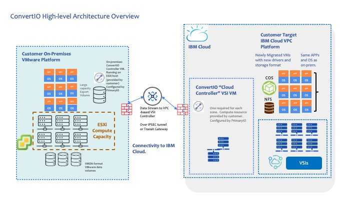
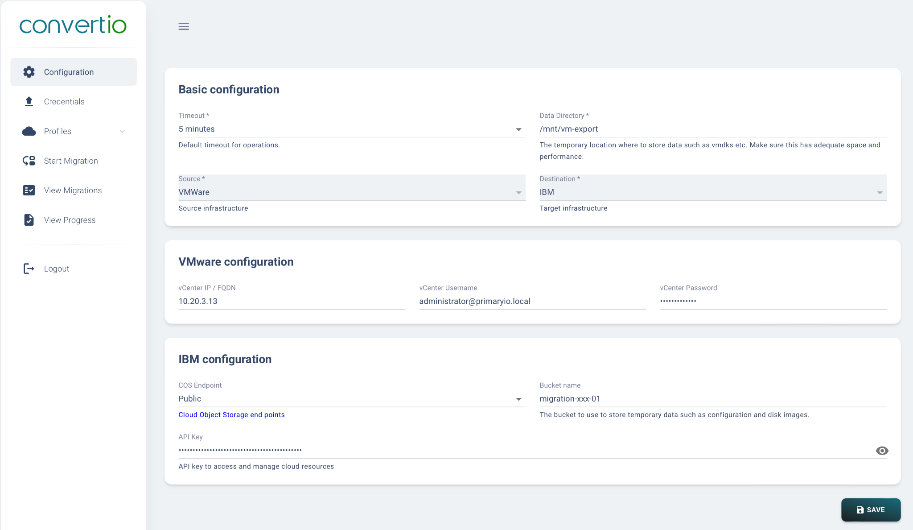

---
copyright:
  years: 2025
lastupdated: "[{22-September-2025}]"

keywords:

subcollection: converio-vmwareworkloads

---

{{site.data.keyword.attribute-definition-list}}

# Executive Summary
{: #executive-summary }

**Overview**
{: #overview}
This whitepaper presents PrimaryIO’s solution framework for migrating VMware workloads from on-premises environments to IBM Cloud Virtual Server Instances (VSIs) hosted within the IBM Virtual Private Cloud (VPC). It outlines the core technology stack, architectural design, implementation methodology, and both functional and non-functional requirements essential for a successful migration.

**Purpose**
{: #purpose}
PrimaryIO empowers organizations to transition to the cloud seamlessly—whether adopting it as a primary production environment or leveraging it for disaster recovery. By offering a comprehensive suite of tools and services, PrimaryIO facilitates efficient, secure, and low-risk migration of VMware workloads to IBM Cloud, ensuring minimal disruption and maximum operational continuity.

**Target Audience**
{: #audience}
This document is intended for key decision-makers and technical stakeholders involved in cloud strategy and infrastructure modernization, including:

-   **CTOs (Chief Technology Officers)** – for evaluating alignment with enterprise cloud adoption goals.
-   **Lead Architects** – for assessing technical feasibility, integration, and scalability.
-   **Chief Architects** – for validating architectural integrity, security posture, and long-term sustainability.
-   **Cloud Infrastructure Managers** – for planning operational execution and resource allocation.
-   **IT Transformation Leaders** – for driving modernization initiatives and business continuity planning.

## Solution Overview
{: #solution-overview}
### Solution to run Cloud-native workloads in IBM Cloud VPC?

Migration Approach  
**PrimaryIO combines software, expertise, and proven processes to deliver a practical solution for low-downtime, application-consistent migration of VMware workloads to IBM Cloud Virtual Server Instances (VSIs)—without relying on VMware post-migration.

Technology  
**The solution, called *ConvertIO*, uses intelligent I/O handling, optimized data transfer, and virtual disk format conversion to minimize migration time, reduce risk, and simplify the overall process.

### Why IBM Cloud VPC?

IBM Cloud VPC offers a secure, scalable, and high-performance infrastructure with high fidelity network control, isolation, and high availability across multiple zones. It delivers on-premises–like VM performance with the cost efficiency and flexibility of the cloud—without requiring VMware.

### Use Case

This solution enables the migration of VMware VMs to IBM Cloud VPC with minimal disruption, and scalable cost efficiency. The primary driver is to reduce reliance on Broadcom VMware by adopting a cloud-native architecture built on the widely used KVM hypervisor.

## Functional Requirements

-   Application-consistent migration of VMs
-   Minimal downtime cutover
-   Limited organization resources
-   VCenter credentials required for configuration modifications
-   Network integration with VPC Subnets
-   Connectivity via IBM Cloud VPN or Direct Link for secure transfer
-   Support for a variety of workloads (x86, flavors of Linux)
-   Operational VMs and associated applications following cutover to VSIs
-   Option for Day-2 assistance with IBM Cloud Console as the new construct management tool in lieu of VMware vSphere.

## Non-Functional Requirements

-   End-to-end data encryption
-   Minimal production site performance degradation during sync
-   Scalability for thousands of VMs
-   Compliance with customer governance and security frameworks

## Pre-requisites for PrimaryIO migration

### On-Prem VMware Environment

-   vCenter 7.X and above
-   VMware tools installed on source VMs
-   SSL certificates

### IBM Cloud VPC

-   VPC infrastructure deployed in target region (e.g., eu-de)
-   Provision Controller VSI in IBM Cloud
-   IBM Cloud VSI images sizing
-   Connectivity (VPN or Direct Link) established
-   SSH/RDP keys provisioned
-   Requisite domain matching and IP addressing managed

## PrimaryIO Components (utilized by PrimaryIO services team)

### IBM Cloud VPC

-   Controller VSI in each VPC migration zone
-   PrimaryIO ConvertIO Controller software on Controller VSI
-   SSL Certificates
-   PrimaryIO Agents (VM migration endpoints)
-   Cloud Gateway (connects to IBM Cloud storage)

### On-Prem VMware Environment

-   ConvertIO software installed on one virtual machine running Rocky Linux 9. The software bundles all components required in one installer. This deployment is adequate for most installations - supporting thousands of VMs. (Performed by PrimaryIO Global Services)
-   1 Linux VM (Cent/OS 7, Rocky Linux 9), Min 8GB RAM, 4 vCPU, 16 GB root disk
-   Additional VM-accessible storage data volume to stage VM exports. Sized to largest VMDK sizing. 8TB as recommended min.

## Technical Architecture

### Architecture for On-premises and IBM Cloud

### Architecture details

-   On-premises resident ConvertIO controller as described in Section 1.5.2. This controller packages up the VM and transmits to a similarly configured Cloud Controller VSI that takes receipt of the transmitted VM.
    -   On-Premises site requires an appropriate network connection to the IBM Cloud VPC, Cloud Controller and associated storage.
    -   Similarly configured Cloud Controller VSI is required for each target migration zone.
    -   Appropriately-sized VSI compute, network and storage needs to be configured in the Customer Target VPC platform

## Architecture design considerations

| **Area**           | **Decision**                                                                             |
|--------------------|------------------------------------------------------------------------------------------|
| Data Transfer Mode | Asynchronous for low impact; app-consistent snapshots for final cutover                  |
| Data Transfer Path | VPN preferred; Direct Link for large workloads                                           |
| Target VM Sizing   | Match CPU/RAM/storage or optimize for IBM Cloud                                          |
| Storage Tier       | Tier 3 Block Storage (Balanced IOPS) for majority; Tier 1 for DBs                        |
| Cutover Plan       | Test in staging VPC; schedule cutover in low-traffic window                              |
| Rollback Plan      | Source VMs remain unmodified, rollback only requires powering on the original source VMs |
| Security Controls  | End-to-end encryption, Authentication in PrimaryIO console                               |

## Attributes, components, considerations for ConvertIO Implementations

### IBM Cloud VPC

It should be noted that the ConvertIO comprises the tooling and service that migrate the VMware VMs from on-prem to VPC VSIs. There are no significant design decisions that need to be made regarding the ConvertIO itself. However, choosing to replatform to IBM Cloud VPC from VMware is a significant decision that will also require decisions on the design and optimal configuration of the landing zone(s) for the newly replatformed workloads.

Regarding Cloud design decisions, in replatforming from VMware (on-prem) to IBM Cloud VSIs, the decisions that need to be made will be cloud-oriented decisions regarding region(s) and zone(s). One of the benefits of Cloud is the ability to locate resources across geographical regions - and within regions, across zones. These kinds of decisions will need to be made based on considerations including on-prem locale, availability, redundancy, business continuity, latency, security and other typical cloud factors.

Regarding the resources required in VPC, sizing for compute, storage and network will be a function of the VMware VM(s) being converted. Similar requirements to the on-prem configurations will be required in IBM Cloud.

Due to the ability to rapidly scale up and down a VPC estate, some VMware VMs might optionally be minimally configured due to only occasional use. No longer any need to pay for what one is not using. Applications can be tiered accordingly such that business-critical workloads can be resourced differently from Dev / Test type workloads.

### Network resource attributes, components for ConvertIO

-   During the data transfer of VMs into IBM Cloud, appropriate assessment for network bandwidth will need to be conducted in order to complete the replatforming in the targeted timeframe required. In terms of limiting bandwidth utilization, ConvertIO does not cap bandwidth at the software level; any limits should be enforced via VMware traffic shaping on the vSwitch or distributed switch.
-   Network needs to enable access to VPC and associated Cloud Object Storage, all VPC zones and Internet access for package installation.

### Security components, attributes for ConvertIO

-   TLS 1.2+ encryption
-   Authentication via IAM roles and credentials
-   Extensive audit logging to Syslog
-   IBM Cloud Object Store Object Lock
-   VPC Security Groups to restrict access

## Outcome-focused Migration Workflow - performed by PrimaryIO

**Discovery Phase**
    -   Identify and prioritize VMs for migration
    -   Inventory source VMs using PrimaryIO Director
    -   Capture details: vCPU, memory, disk size, OS, IPs, services, dependencies
    -   Analyze compatibilities
    -   Discovery phase will necessitate PrimaryIO access to understand the on-premises VMware estate. Ideally this would include an RVTools output as well as vCenter credentials with the appropriate privileges to enumerate VMs, read configs, and validate snapshots/clones. In addition, an assessment of current state network/edge architecture would be necessary in order to implement analogous resources for the IBM Cloud estate.
**Preparation Phase**
    -   Select VM candidates. Filter out non-candidates based on select criteria
    -   Tag VMs by workload category (app, DB, utility) and criticality
    -   Map dependencies leveraging tooling
    -   Batch VMs into migration sub-groups; document, include rollback plan
    -   Define, configure networking.
    -   Deploy PrimaryIO Agents
    -   Select IBM Cloud (target) zone
    -   Provision IBM Cloud environment (VPC, subnets, routing tables, gateway(s), security groups, object storage, SSH keys, IAM roles
    -   Establish VPN/Direct link to IBM Cloud environment
**Migration Phase**
    -   Deploy ConvertIO software on source and target
    -   Create ConvertIO migration profiles
    -   Validate - using test workload(s)
    -   Execute migration batches for Incremental data sync
    -   Application-consistent snapshots
**Cutover Phase**
    -   Shut down source VMs
    -   Final sync
    -   Boot VMs in IBM Cloud VPC
    -   Validate application services
**Post-Migration**
    -   Decommission old agents
    -   Optimize cloud instances
    -   Enable monitoring with IBM Cloud Monitoring

ConvertIO UI utilized to generate conversion profile enabling conversion at scale.

## Migration considerations

Security
    -   Encrypts all storage and data-in-flight.
Performance
    -   Throttle migrations based on available bandwidth and IOPS.
Extensibility
    -   Profile-driven approach allows repeatability and scale-out for additional zones or workloads.
Documentation
    -   Maintain runbooks, rollback plans, and architectural diagrams.

## Benefits

-   Complete VM migration - managed by PrimaryIO
-   Zero-rebuild target VMs
-   Reduced migration effort and timeline
-   Predictable outcome
-   Scalable and repeatable process
-   Tight integration with IBM Cloud infrastructure

## Limitations & Risks

-   Network throughput limitations during sync
-   Need for firewall/VPN configuration
-   Ability to provide required credentials to enable services team access
-   Older O/S versions internal to VMs with drivers that are no longer compatible with target environment
-   Complex app dependencies needing post-migration workload testing

## Reference links

1.  IBM Cloud Catalog Tile

    <https://cloud.ibm.com/catalog/services/convertio-vmware-workload-migration-and-conversion>

2.  ConvertIO webpage on PrimaryIO.com

    <https://www.primaryio.com/convertio/>

## Conclusion

ConvertIO is a service-wrapped technology focused on the outcome of re-platforming VMware VMs to IBM Cloud VPC Virtual Server Instances. While many details are presented in this document, this level of detail is only to increase understanding and enable decision-making. The knowledge is primarily useful and codified in processes, documents and tools utilized by the PrimaryIO Global Services Team members. The ultimate outcome is to predictably transition existing VMware workloads to IBM Cloud-native workloads without disruption to existing operations.
