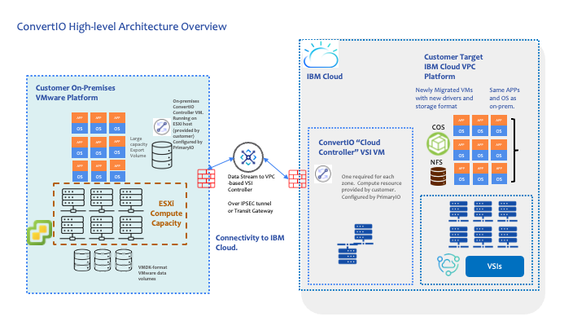

---
copyright:
  years: 2025
lastupdated: "2026-03-25"

keywords:

subcollection: converio-vmwareworkloads

---

{{site.data.keyword.attribute-definition-list}}

# Migrating VMware workloads to IBM Cloud-native VSIs in VPC with PrimaryIO
{: #Primaryio-convertio}

PrimaryIO empowers organizations to transition to the cloud seamlessly—whether adopting it as a primary production environment or leveraging it for disaster recovery. By offering a comprehensive suite of tools and services, PrimaryIO facilitates efficient, secure, and low-risk migration of VMware workloads to IBM Cloud, ensuring minimal disruption and maximum operational continuity.
{: shortdesc}

This whitepaper presents PrimaryIO’s solution framework for migrating VMware workloads from on-premises environments to IBM Cloud Virtual Server Instances (VSIs) hosted within the IBM Virtual Private Cloud (VPC). It outlines the core technology stack, architectural design, implementation methodology, and both functional and non-functional requirements essential for a successful migration.

This document is intended for key decision-makers and technical stakeholders involved in cloud strategy and infrastructure modernization, including:

-   **CTOs (Chief Technology Officers)** – for evaluating alignment with enterprise cloud adoption goals.
-   **Lead Architects** – for assessing technical feasibility, integration, and scalability.
-   **Chief Architects** – for validating architectural integrity, security posture, and long-term sustainability.
-   **Cloud Infrastructure Managers** – for planning operational execution and resource allocation.
-   **IT Transformation Leaders** – for driving modernization initiatives and business continuity planning.

## Before you begin
{: #before-begin}

Before you can start migrating by using PrimaryIO, be sure that you have the following prerequistes.

* An On-prem VMware environment
	* vCenter 7.x and higher
	* VMware tools installed on source VMs
	* VCenter credentials required for configuration modifications
	* Agreed migration cutover to cloud
	* SSL certificate
	* ConvertIO software that is installed on a virtual machine that is running Rocky Linux 9. It needs to have a minimum of 8GB RAM, 4vCPU, and a 16GB root disk.
	* An additional VM-accessible storage data volume to stage exports. It should be sized at the largest VMDK sizing - at least 8TB as a recommended minimum.
	* Align to customer's compliance and security frameworks

* IBM Cloud VPC
	* VPC infrastructure deployed in a target region
	* Provision controller VSI in IBM Cloud
	* IBM Cloud VSI images sizing
	* Connectivity (VPN or Direct Link) established
	* SSH/RDP keys provisioned
	* Encryption as needed by the customer
	* Requiste domain matching and IP addressing managed
	* A controller VSI in each VPC migration zone
	* PrimaryIO ConvertIO controller software on the controller VSI
	* SSK certificates
	* PrimaryIO agents and VM migration endpoints
	* A cloud gateway to connect to storage

## Understanding the architecture
{: #understand-arch}

IBM Cloud Virtual Private Cloud offers a secure, scalable, and high-performance infrastructure with high fidelity network control, isolation, and high availability across multiple zones. It delivers on-premises–like VM performance with the cost efficiency and flexibility of the cloud.

Migrating to VPC can be done with minimal disruption and a scalable cost efficiency. A primary driver might be to reduce reliance on Broadcom VMware by adopting a cloud-native architecture built on the widely used KVM hypervisor. PrimaryIO combines software, expertise, and proven processes to deliver a practical solution for low-downtime, application-consistent migration of VMware workloads to IBM Cloud Virtual Server Instances (VSIs) without relying on VMware post-migration.

The solution, called *[ConvertIO](https://www.primaryio.com/convertio/)* uses intelligent I/O handling, optimized data transfer, and virtual disk format conversion to minimize migration time, reduce risk, and simplify the overall process. Check out the following diagram to see a high level CovertIo architecture.

{: caption="ConvertIO High-level Architecture" caption-side="bottom"}

-   On-premises resident ConvertIO controller as described in Section 1.5.2. This controller packages up the VM and transmits to a similarly configured Cloud Controller VSI that takes receipt of the transmitted VM.
    -   On-Premises site requires an appropriate network connection to the IBM Cloud VPC, Cloud Controller and associated storage.
    -   Similarly configured Cloud Controller VSI is required for each target migration zone.
    -   Appropriately-sized VSI compute, network and storage needs to be configured in the Customer Target VPC platform

### How migration works
{: #how-migration-works}

In the following image, you can see a profile, that is built by convertIO that is used for the migration. When you're ready to get started, see the [IBM Cloud catalog tile](https://cloud.ibm.com/catalog/services/convertio-vmware-workload-migration-and-conversion).

{: caption="Configuration for ConvertIO" caption-side="bottom"}

Migration occurs in five phases.

Discovery
:   In the discovery phase, you identify and prioritize your VMs for migration by using the PrimaryIO director to source your inventory. This phase necessitates PrimaryIO have access to your VMs, including RVTools output and vCenter credentials that have permissions to enumerate VMs, read configs, and validate snapshots and clones. Also, an assessment of the current network or edge architecture is necessary to implement analogous resources in IBM Cloud. The director captures detials such as vCPU, memory, disk size, Operating system, IP addresses, services, and dependencies.

Preparation
:   In the preparation phase, you select and prepare the VM candidates for migration and filter out non-candidates based on select criteria. To get started, you will tag your VMs by workload category and ciriticality, for example app, critical. Then, map dependencies and batch VMs into migration subgroups before documenting everything including a rollback plan. Next, you can define and configure networking before deploying your PrimaryIO agents. Lastly, provision your IBM Cloud environment by selecting a target zone, and setting up your VPC, subnets, routing tables, gateways, security groups, object storage, SSH keys, IAM roles, and a VPN or Direct Link.

Migration
:   In the migration phase, ConvertIO is deployed on both the source and target. Get started by creating ConvertIO migration profiles and validate them by using a test workload. When you're ready, execute the migration in batches for incremental data sync and application-consistent snapshots.

Cutover
:   In the cutover phase, your migration is mostly complete. You're ready to boot the VMs in IBM Cloud VPC, do one final sync, validate your application services, and shut down the source VMs.

Post-migration
:   In the post-migration phase, you're ready to start working exclusively in IBM Cloud. Don't forget to decommission any old agents, and optimize your cloud isntances. Consider enabling monitoring with IBM Cloud Monitoring.

### Migration considerations
{: #migration-considerations}

Consider the following areas before starting your migration.

Security
    -   Encrypts all storage and data-in-flight.

Performance
    -   Throttle migrations based on available bandwidth and IOPS.

Extensibility
    -   Profile-driven approach allows repeatability and scale-out for additional zones or workloads.

Documentation
    -   Maintain runbooks, rollback plans, and architectural diagrams.

### Benefits
{: #benefits}

Learn more about the benefits of migrating.

-   Complete VM migration - managed by PrimaryIO
-   Zero-rebuild target VMs
-   Reduced migration effort and timeline
-   Predictable outcome
-   Scalable and repeatable process
-   Tight integration with IBM Cloud infrastructure

### Limitations & Risks
{: #limitations}

Be sure that you understand the limitations and risks of migrating.

-   Network throughput limitations during sync
-   Need for firewall/VPN configuration
-   Ability to provide required credentials to enable services team access
-   Older O/S versions internal to VMs with drivers that are no longer compatible with target environment
-   Complex app dependencies needing post-migration workload testing

## Architecture design considerations
{: #decisions}

| **Area**           | **Decision**                                                                             |
|--------------------|------------------------------------------------------------------------------------------|
| Data Transfer Mode | Asynchronous for low impact; app-consistent snapshots for final cutover                  |
| Data Transfer Path | VPN preferred; Direct Link for large workloads                                           |
| Target VM Sizing   | Match CPU/RAM/storage or optimize for IBM Cloud                                          |
| Storage Tier       | Tier 3 Block Storage (Balanced IOPS) for majority; Tier 1 for DBs                        |
| Cutover Plan       | Test in staging VPC; schedule cutover in low-traffic window                              |
| Rollback Plan      | Source VMs remain unmodified, rollback only requires powering on the original source VMs |
| Security Controls  | End-to-end encryption, Authentication in PrimaryIO console                               |
{: caption="Design considerations" caption-side="bottom"}

## Attributes, components, considerations for ConvertIO Implementations
{: #considerations}

### IBM Cloud VPC
{: #vpc-considerations}

It should be noted that the ConvertIO comprises the tooling and service that migrate the VMware VMs from on-prem to VPC VSIs. There are no significant design decisions that need to be made regarding the ConvertIO itself. However, choosing to replatform to IBM Cloud VPC from VMware is a significant decision that will also require decisions on the design and optimal configuration of the landing zone(s) for the newly replatformed workloads.

Regarding Cloud design decisions, in replatforming from VMware (on-prem) to IBM Cloud VSIs, the decisions that need to be made will be cloud-oriented decisions regarding region(s) and zone(s). One of the benefits of Cloud is the ability to locate resources across geographical regions - and within regions, across zones. These kinds of decisions will need to be made based on considerations including on-prem locale, availability, redundancy, business continuity, latency, security and other typical cloud factors.

Regarding the resources required in VPC, sizing for compute, storage and network will be a function of the VMware VM(s) being converted. Similar requirements to the on-prem configurations will be required in IBM Cloud.

Due to the ability to rapidly scale up and down a VPC estate, some VMware VMs might optionally be minimally configured due to only occasional use. No longer any need to pay for what one is not using. Applications can be tiered accordingly such that business-critical workloads can be resourced differently from Dev / Test type workloads.

### Network resource attributes, components for ConvertIO
{: #network-considerations}

-   During the data transfer of VMs into IBM Cloud, appropriate assessment for network bandwidth will need to be conducted in order to complete the replatforming in the targeted timeframe required. In terms of limiting bandwidth utilization, ConvertIO does not cap bandwidth at the software level; any limits should be enforced via VMware traffic shaping on the vSwitch or distributed switch.
-   Network needs to enable access to VPC and associated Cloud Object Storage, all VPC zones and Internet access for package installation.

### Migration, deployment strategy
{: #migration-strategy}

Check out the following table to learn more about an example deployment strategy for migration.

| Design Consideration            | Requirement                                          | Options                                                           | PrimaryIO Design Guidance                                                                                                                         | Rationale                                                                        |
|---------------------------------|------------------------------------------------------|-------------------------------------------------------------------|---------------------------------------------------------------------------------------------------------------------------------------------------|----------------------------------------------------------------------------------|
| Migration Type - Cold (Offline) | Connectivity to Replicate workloads to IBM Cloud VPC | Workloads Replicated  VM Validation and Performance Verification  | This approach allows workloads to be fully tested prior to VM failover from Source  Final Data Sync will be required prior to production failover | Proves the platform configuration and functionality prior to production failover |
| Migration Type - Warm (Online)  | Routed or Stretched Network into IBM Cloud           | Workloads Replicated with same of different IP addressing         | This approach allows the destination landing zone to be built and configured allowing a coexistence with the source platform                      | Enables minimal disruption and seamless transition for production workloads      |
{: caption="Migration deployment strategy considerations" caption-side="bottom"}

### Security components, attributes for ConvertIO
{: #security-considerations}

Be sure that you understand the security components and attributes for ConvertIO

-   TLS 1.2+ encryption
-   Authentication via IAM roles and credentials
-   Extensive audit logging to Syslog
-   IBM Cloud Object Store Object Lock
-   VPC Security Groups to restrict access
